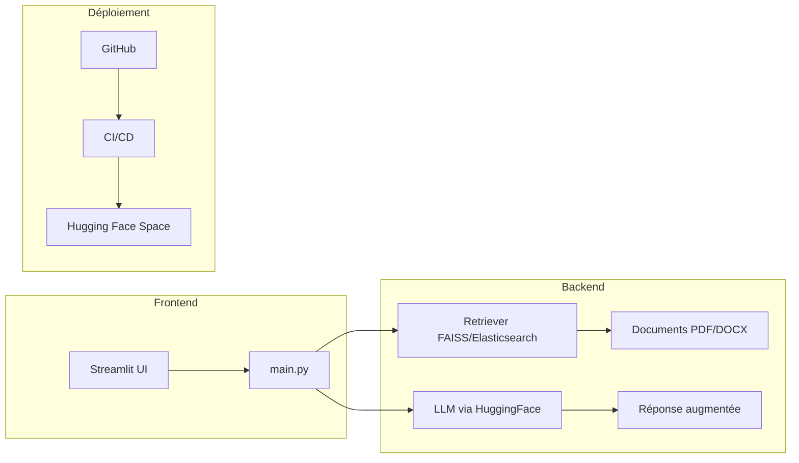


<div align="center">
  <!--  -->
  
</div>

# AgroRAG

AgroRAG est une application d'intelligence artificielle basée sur le principe de Retrieval-Augmented Generation (RAG). Elle vise à fournir des réponses contextualisées à des questions agricoles en s'appuyant sur une base documentaire locale adaptée au saison, sols, spéculations, etc au Burkina Faso.

## 🚀 Objectifs

- Faciliter l'accès à l'information agricole pour les agriculteurs et agripreneurs
- Exploiter des documents locaux (rapports, guides techniques, PDF, etc.) pour répondre précisément aux questions
- Déployer un agent IA accessible en ligne via Hugging Face Spaces

## 🏗️ Architecture du Projet



## 🛠️ Stack Technique

- **Python** : Langage de base pour le développement de l'application
- **Streamlit** : Framework pour la création de l'interface utilisateur interactive
- **Transformers / LangChain** : Outils pour l'intégration des LLM et la construction du pipeline RAG
- **FAISS / Elasticsearch** : Bases de données vectorielles pour la recherche sémantique
- **GitHub + Hugging Face Space** : Outils de versionnement et de déploiement

## 📁 Structure du Projet

```
agroRAG/
├── app/               # Interface utilisateur Streamlit
│   ├── main.py        # Point d'entrée principal
│   ├── style.css      # Styles personnalisés
│   └── ui.py          # Composants d'interface
├── backend/           # Logique métier et RAG
│   ├── embedder.py    # Génération d'embeddings
│   ├── loader.py      # Chargement des documents
│   ├── rag_pipeline.py # Pipeline RAG complet
│   └── retriever.py   # Module de récupération de documents
├── crawler/           # Crée ce dossier pour le crawler
│   └── agro_crawler.py         # Script de crawling principal
├── data/                       # Données et documents
│   ├── documents/              # Documents sources (PDF, DOCX, etc.)
│   └── indexed_documents.yaml  # Index des documents trouvés automatiquement
├── notebooks/                  # Jupyter notebooks pour l'exploration
│   ├── exploration.ipynb
│   └── genProjet.ipynb
├── utils/             # Utilitaires divers
│   ├── cleaning.py    # Nettoyage des données
│   └── config.py      # Configuration du projet
├── requirements.txt   # Dépendances du projet
└── space.yaml         # Configuration pour Hugging Face Spaces
```

## 🚀 Comment démarrer

1. **Cloner le dépôt**
   ```bash
   git clone https://github.com/votre-utilisateur/agroRAG.git
   cd agroRAG
   ```

2. **Installer les dépendances**
   ```bash
   pip install -r requirements.txt
   ```

3. **Lancer l'application**
   ```bash
   streamlit run app/main.py
   ```


## 📄 Licence

Ce projet est sous licence MIT. Créé par Armel Soubeiga.

